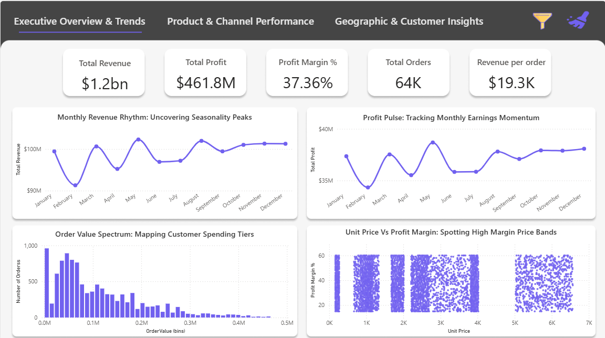
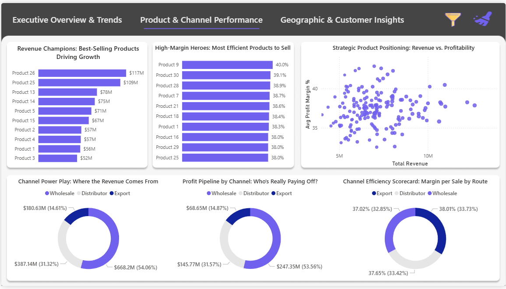
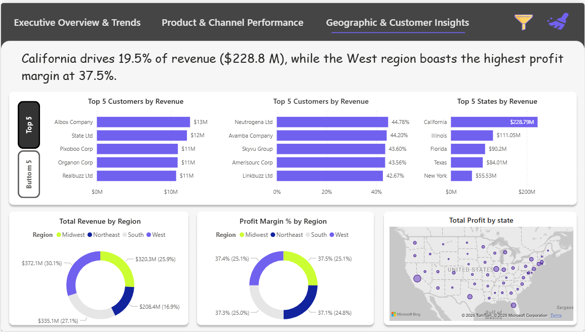

# Regional-Sales-Analysis
## Overview
The Regional Sales Analysis Dashboard is a business intelligence project aimed at visualizing sales data across various regions and product categories. Using Power BI, the project transforms raw sales data into interactive charts and dashboards, enabling clear insights into key performance indicators, sales trends, and regional performance comparisons. This tool helps stakeholders make informed, data-driven decisions with ease and clarity.
---

## Problem Statement
Businesses often generate vast amounts of sales data but lack the tools to effectively analyze and extract meaningful insights from it. This leads to missed opportunities, inefficient strategies, and poor decision-making. The challenge lies in presenting complex data in a way that is both accessible and actionable.  
This project addresses that gap by building an interactive Power BI dashboard that allows users to monitor regional sales performance, identify trends, compare product categories, and track key sales metrics in a single, consolidated view.
---

## 🛠️ Features
- 📊 Interactive dashboard with regional and category filters  
- 🧩 KPI cards (total sales, top region, top category, etc.)  
- 📈 Monthly sales trends and visual comparisons  
- 📍 Region-wise performance breakdown  
- 📦 Category-wise contribution analysis
---

## 🧰 Tools & Technologies Used
- **Power BI** – for data visualisation and dashboard creation  
- **Excel Dataset** – for data preparation and cleaning  
- **Python** - for preprocessing the data
---

## 📸 Dashboard Preview
### 🔹 Executive Overview & Trends

### 🔹 Product & Channel Performance

### 🔹 Geographic & Customer Insights

